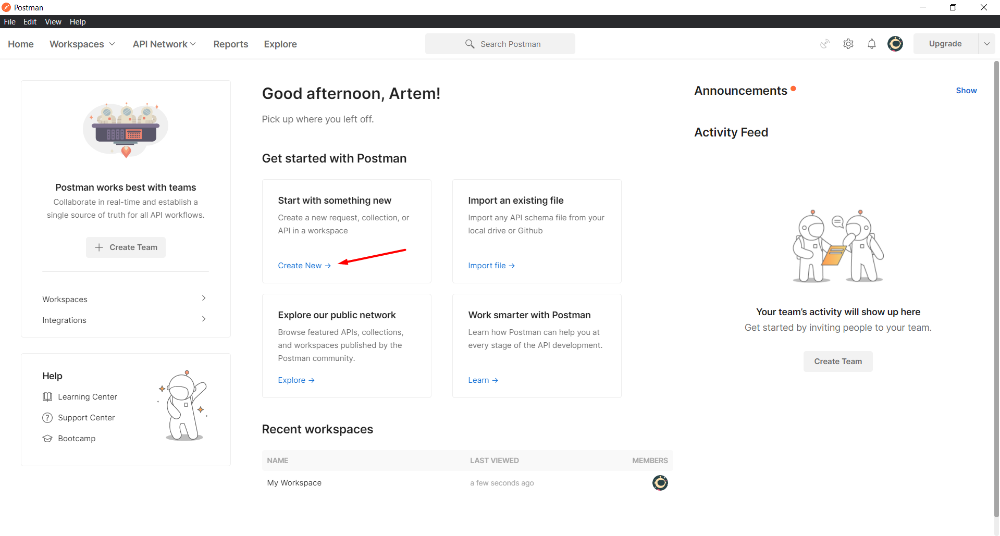
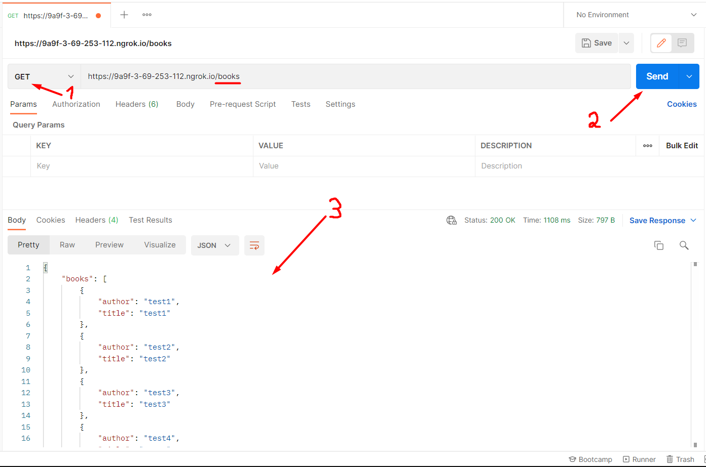
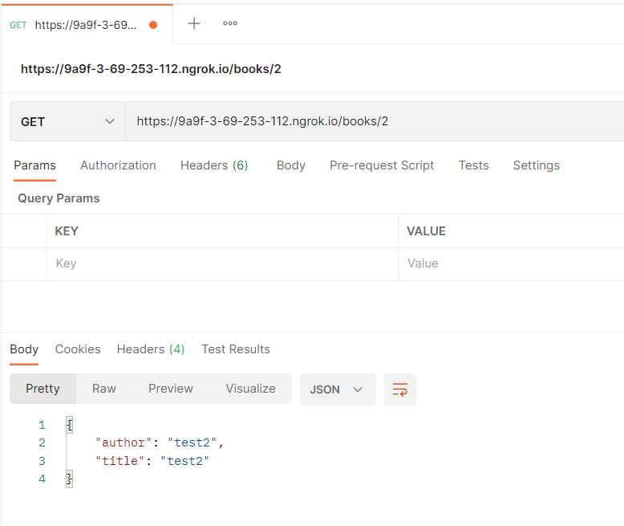
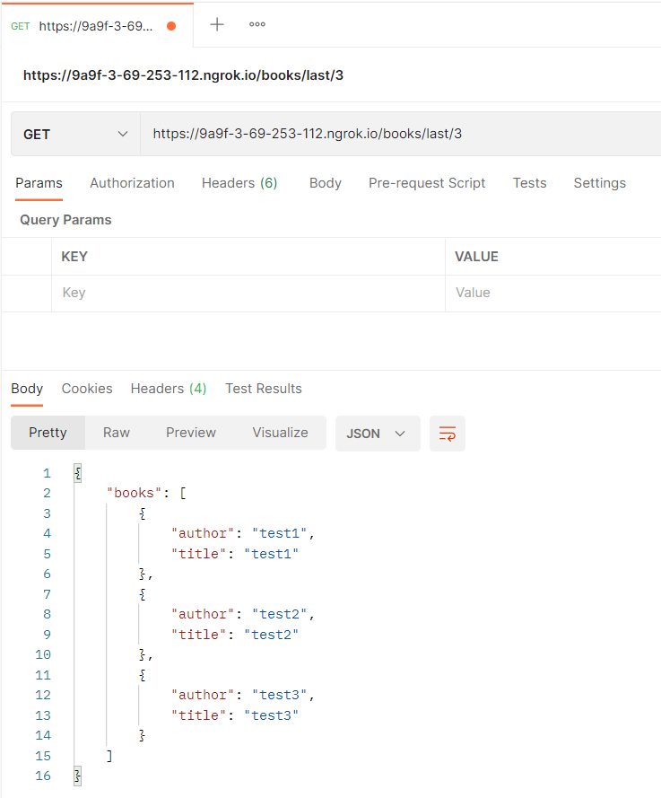
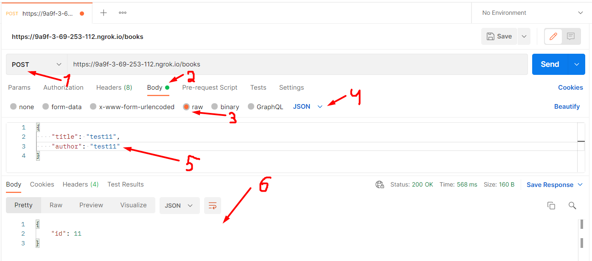
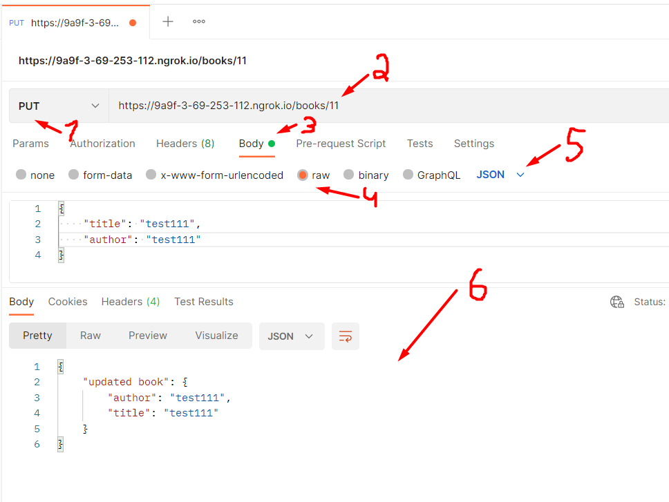
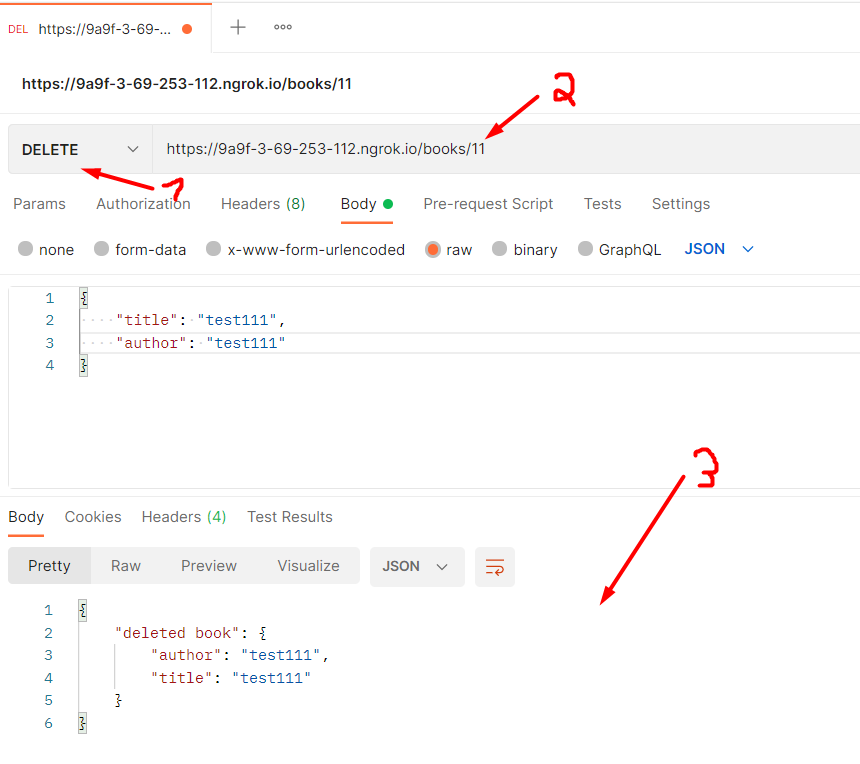

In this task I have created a Flask app, that implements API with CRUD functionality.  
To use it you have to install Postman. You can download it from the official website - https://www.postman.com/.  
After you have downloaded it and registered an account, you have to create new HTTP Request:  

Then, you have to enter following url - https://9a9f-3-69-253-112.ngrok.io  
To get all the books, you have to perform a GET request to "/books". You will get a response in JSON format:  

To get the book by id, you have to perform a GET request to "/books/id", where "id" is id of book, you want to get:  
  
To get last n books, you have to perform a GET request to "/books/last/n", where "n" is number, you want to get:  
  
To add a new book, you have to perform a POST request to "/books". To provide book parameters, you have to write them in a JSON format. You will get back an id of your book, which is generated automatically:  

To change book info, you have to perform a PUT request to "/books/id", where "id" is id of book, you want to change. You will get back new book data in JSON format:  

To delete a book, you have to perform a DELETE request to "/books/id", where "id" is id of book, you want to delete. You will get back this book data in JSON format:  

