To start, you go to the home page url - https://9a9f-3-69-253-112.ngrok.io/ui  
There you will see 4 buttons, one for which of the requests:
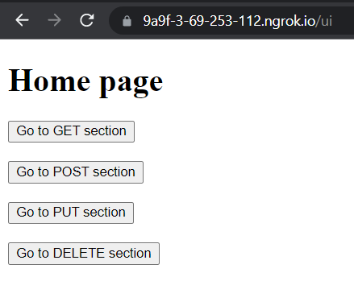
In GET section,  you will see 3 buttons:
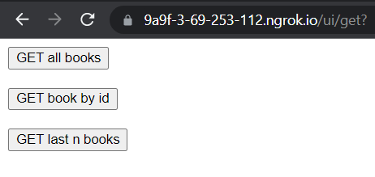
If you press "GET all books" button, you will be taken to https://9a9f-3-69-253-112.ngrok.io/books page, where you will see a list of all the books
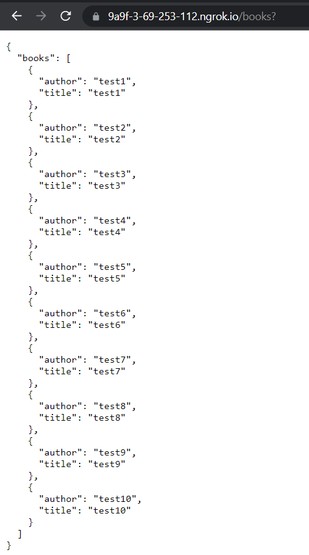
If you press "GET book by id" button, you will be taken to https://9a9f-3-69-253-112.ngrok.io/ui/get/id page, where you will have to enter the id of a book, you want to get. In response, you will get it's data in JSON format:
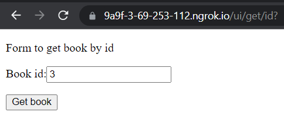
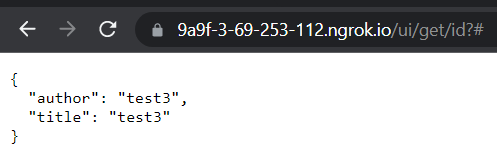
If you press "GET last n books" button, you will be taken to https://9a9f-3-69-253-112.ngrok.io/ui/get/last page, where you will have to enter the number of books, you want to get. In response, you will get their data in JSON format:
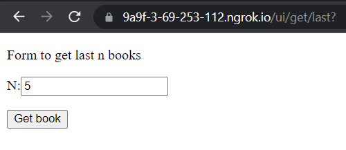
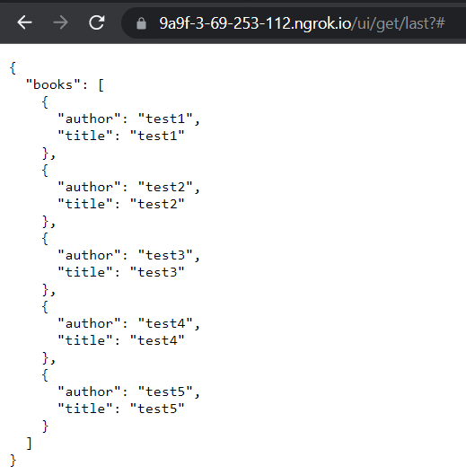
In POST section you will see a form to add a new book. You will have to enter book's title and author. In response, you will get book's id:
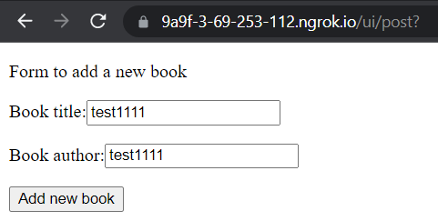
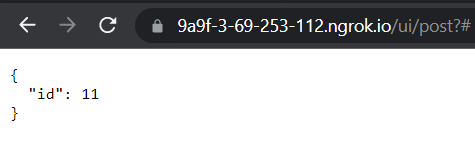
In PUT section you will see a form to edit a book. You will have to enter book's id, title and author. In response, you will get book's data in JSON format:
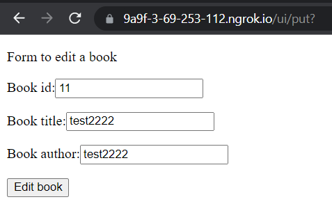
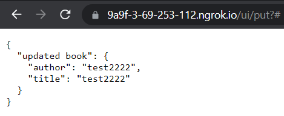
In DELETE section you will see a form to delete a book. You will have to enter book's id. In response, you will get deleted book's data in JSON format:
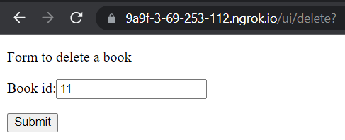
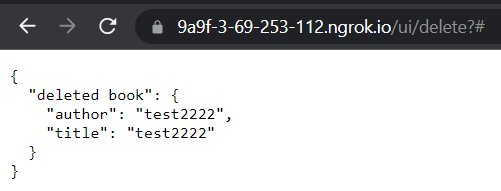