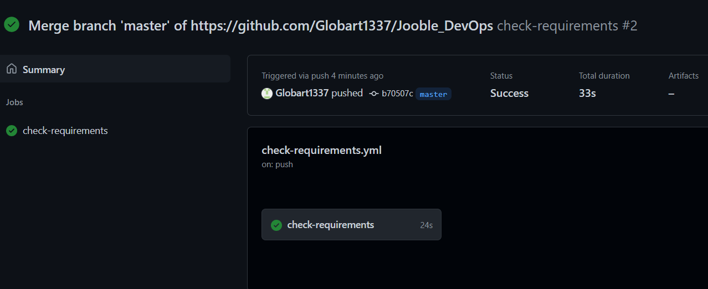
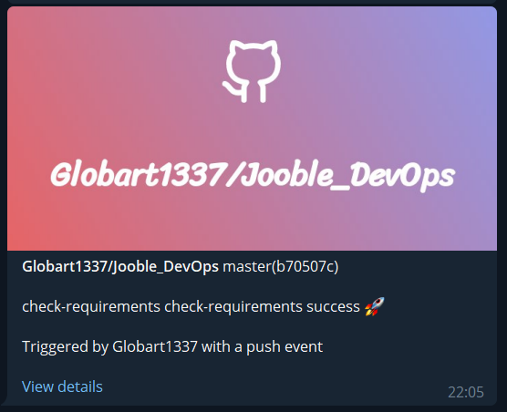

In this task, I have used GitHub Actions to create a workflow that will check(on push to master branch) if you can install Python dependencies from requirements.txt file and will send the result to Telegram.

